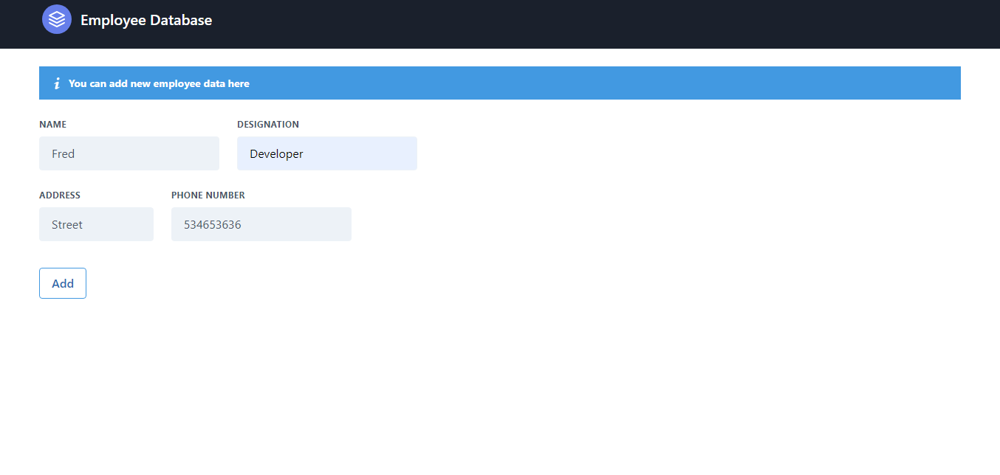
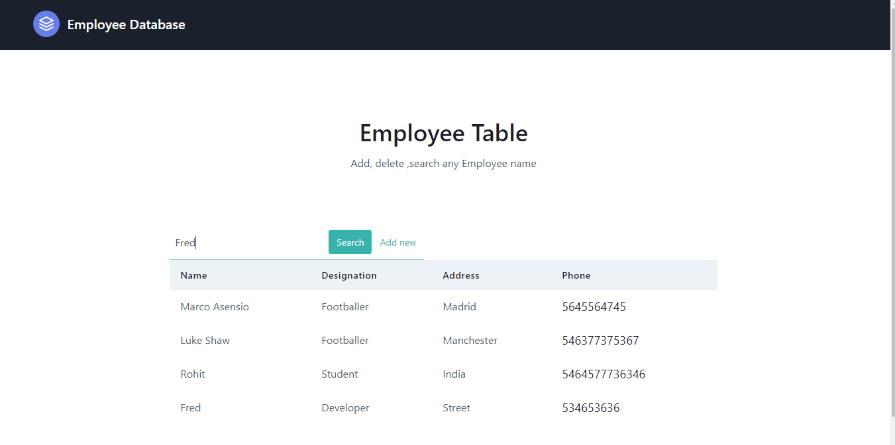
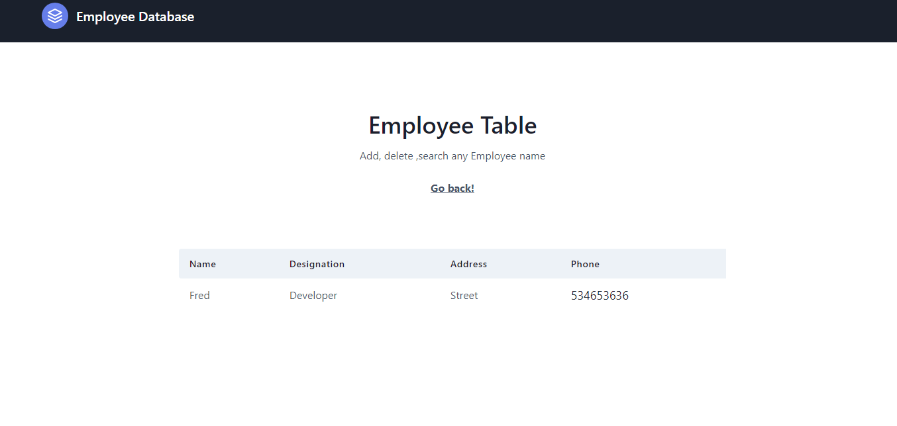
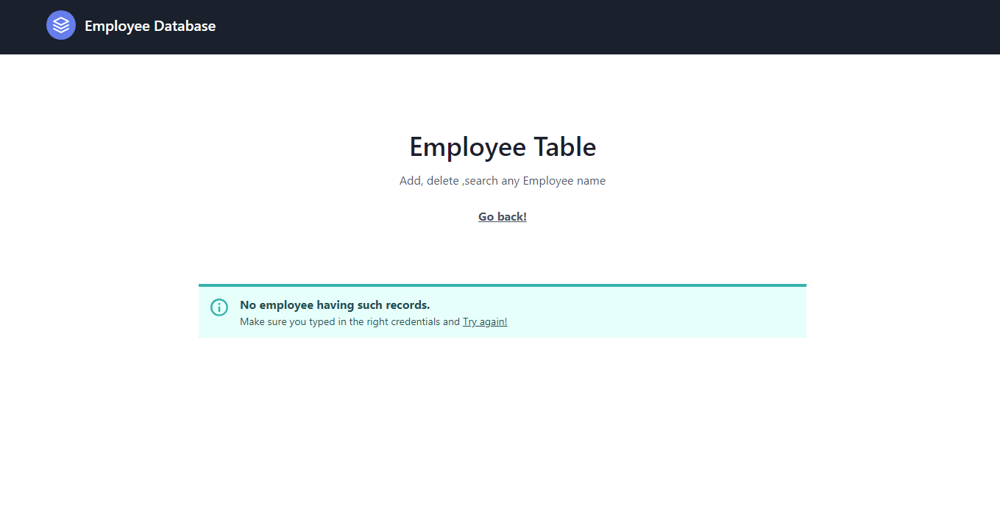

# flask--add-employees

Basic Flask application to add employees.
1. User can add employees' data
2. view them
3. Search for them which includes all the table fields

  <h4>Main view and table view</h4> 
  
   
  <h4>Adding new employee credential</h4> 
  
   
    <h4>Viewing new employee credential added</h4> 
  
   
      <h4>Searching an employee credential added</h4> 
  
   
        <h4>When data searched is not found</h4> 
  
   

  

